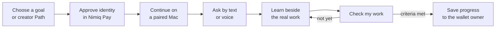
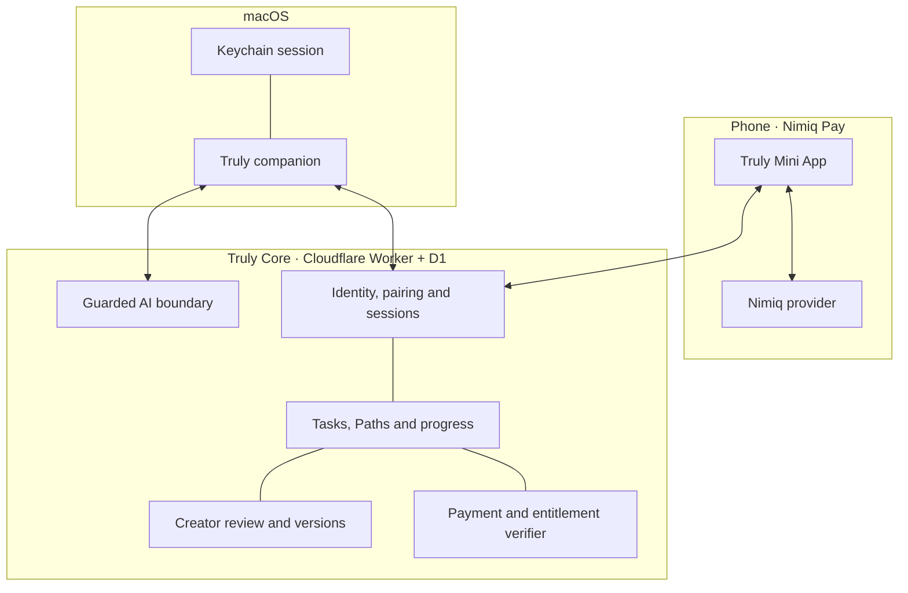

<div align="center">
  
  <h1>Truly</h1>
  <p><strong>Learn anything. By doing it.</strong></p>
  <p>A screen-aware learning companion that carries a goal from your Nimiq wallet to your Mac, teaches beside the real work, and saves progress only after you show what you did.</p>
  <p>
    <a href="#the-loop">The product</a> ·
    <a href="#why-nimiq">Why Nimiq</a> ·
    <a href="#run-it-locally">Run it</a> ·
    <a href="docs/ARCHITECTURE.md">Architecture</a> ·
    <a href="docs/PRODUCT-GUIDE.md">Product guide</a>
  </p>
</div>

> Built for the Nimiq Mini Apps Competition. The current payment experience runs on Nimiq Testnet; test NIM has no real-world value.

## The problem

Learning usually breaks at the exact moment it should become useful.

You leave the editor, browser or design tool. You open a tutorial. You lose the context. You collect information, but still do not know what to do next—or whether what you tried actually worked.

Truly closes that gap. The learner chooses a goal on their phone, sends it to a paired Mac, and gets contextual help beside the application where the work is happening. A creator can turn expertise into a reviewed, ordered Path and choose to publish it for free or price it in NIM.

## The loop



On the Mac, the companion can sit beside any visible part of the screen. Ask it to explain what you see, guide one next action, or speak the question and let Truly speak back. Teaching and completion are deliberately separate: an answer never awards progress. **Check my work** captures fresh, visible evidence and advances only when every saved criterion is met.

## What exists today

| Surface | What it does |
| --- | --- |
| **Truly for macOS** | Draggable screen-aware companion; text and voice questions; Explain and Guide modes; optional spoken replies; Task panel, resources and explicit AI-checked practice. |
| **Truly Mini App** | Nimiq wallet identity, account choice, signed Mac pairing, private Tasks, creator Paths, NIM testnet purchase, durable progress, devices and access activity. |
| **Creator Studio** | Wallet-signed public profiles; private drafts; ordered steps and resources; free or NIM access; learner preview; locked submission; wallet-authenticated review and versioned publishing. |
| **Truly Core** | Owner-scoped authority, pairing, sessions, immutable Path versions, guarded AI, independent payment verification, entitlements, progress and review receipts. |
| **Product site** | Public product story plus a concise, non-technical `/docs` guide for learners and creators. |

### Working proof, not a mock checkout

- A real **0.01 test-NIM** purchase of *NIM payments users can trust* passed native Nimiq Pay confirmation, independent settlement checks and exactly-once Path unlock.
- The purchased Path moved from phone to Mac, completed its first visible practice check, synchronized to **1 of 3**, and retained that progress after both clients restarted.
- Real microphone input and spoken Truly replies have been exercised on the Mac.
- Creator profiles, private drafts, free/NIM pricing, review decisions and frozen published versions are implemented and covered by the Core test suite.

The full three-step Path rehearsal, hostile/unclear screen-quality matrix, broader voice-noise testing, hosted deployment and signed public macOS distribution remain release gates. Truly labels assessment **AI-checked**, never certified.

## Product views

<table>
  <tr>
    <td width="50%"></td>
    <td width="50%"></td>
  </tr>
  <tr>
    <td colspan="2"></td>
  </tr>
</table>

## Tasks and Paths are different on purpose

**A Task is yours.** Start with an immediate goal, review the proposed steps, edit the plan before beginning and keep the result private to your wallet.

**A Path is published expertise.** It has a creator, ordered steps, useful links, practice challenges, visible completion criteria, an immutable version and optional NIM access. Starting a Path creates a learner-owned Task, so progress belongs to the learner without mutating the creator’s original.

Creators can publish a Path for free or monetize it in NIM. Drafts stay private. Publishing requires review in this beta, and an approved update creates a new version so existing learners keep the exact plan they started.

## Why Nimiq

Nimiq is not a checkout button attached to Truly. It is the ownership layer connecting the whole experience.

1. **Identity without another password.** A purpose-bound wallet signature proves which learner, creator or reviewer is acting. A pasted public address is never treated as ownership.
2. **Deliberate device trust.** The wallet approves the exact Mac being paired, while revocation remains available from the phone.
3. **Native creator commerce.** A Path shows its version, price, network, creator and recipient before Nimiq Pay presents the transaction. Truly never handles wallet keys.
4. **Independent access decisions.** Core does not trust a client-side “success.” It verifies the finalized transfer and grants one durable entitlement exactly once.
5. **Portable continuity.** Purchases, Tasks, Path versions and progress stay bound to the wallet owner across phone and Mac.

Nimiq Pay remains authoritative for the complete wallet portfolio and transaction history, including wallet-managed contract funds. Truly intentionally shows only the Path payments and access it has independently validated.

## Trust is a product feature

| Promise | Enforcement |
| --- | --- |
| **No background screen history** | A bounded frame leaves the Mac only after Ask, an explicitly completed voice question or Check my work. Truly does not persist screenshots. |
| **Teaching cannot fake progress** | The teaching endpoint always returns `progressRecorded: false`; assessment is a separate authenticated action. |
| **The wallet stays in charge** | Pairing, sign-in and payment use Nimiq Pay confirmations. Truly never asks for recovery words or private keys. |
| **Clients do not grant themselves access** | Core resolves the current price/version and independently verifies settlement before writing an entitlement. |
| **Creator updates cannot rewrite history** | Learner Tasks pin an approved Path version and access snapshot. Later updates append a version. |
| **Review authority is server-owned** | Reviewer wallets come from a server allowlist and approve a locked revision with an auditable wallet identity. |

Read the full [privacy direction](docs/PRIVACY.md), [architecture](docs/ARCHITECTURE.md) and [Creator Studio operating guide](docs/CREATOR-STUDIO.md).

## Architecture at a glance



The wallet never exposes keys to the Mini App. The desktop cannot manage wallet devices or buy a Path. The Mini App cannot invent completion. Core is the only authority that joins identity, device, immutable content, payment access and current progress.

## Run it locally

### Requirements

- macOS with Xcode
- Node.js 22.13 or newer
- Nimiq Pay on a phone for native wallet/signature/payment flows
- A Cloudflare account only if you choose to deploy; local D1 works without one
- A Groq API key and confirmed Zero Data Retention setting for AI requests

Clone and enter the repository:

```bash
git clone https://github.com/Femtech-web/Truly.git
cd Truly
```

### 1. Start Truly Core

```bash
cd worker
npm install --legacy-peer-deps
cp .dev.vars.example .dev.vars
npm run db:migrate:local
npm run dev
```

Set the exact Mini App origin in `ALLOWED_ORIGINS` and `PAIRING_ORIGIN`. For phone testing, use the Mac’s LAN address rather than `localhost`. Keep payment flags off unless you are following the controlled testnet procedure in [worker/README.md](worker/README.md).

### 2. Start the Mini App

In another terminal:

```bash
cd apps/miniapp
npm install
cp .env.example .env
npm run dev -- --host 0.0.0.0
```

Set `VITE_TRULY_CORE_URL` to the Core URL reachable from the phone, then open Vite’s Network URL inside Nimiq Pay. A normal browser can preview public screens but cannot supply wallet identity.

### 3. Run Truly for macOS

Open `apps/desktop/Truly.xcodeproj`, select **Truly → My Mac**, and press **Command–R**. Grant Screen Recording when macOS asks. Microphone and Speech Recognition are separate, optional permissions used only for voice.

Open the menu-bar app, go to **Settings → Connection**, and pair the Mac from the Mini App’s **Devices** screen.

### 4. Optional: run the product site

```bash
cd apps/site
npm install
npm run dev
```

Visit `/docs` for the learner-and-creator guide.

Stop each development server with **Control–C** when finished.

## Verification

No command below needs a wallet, real funds or an external AI request:

```bash
# Core protocol, persistence, payments and Creator Studio
cd worker && npm test && npm run build

# Mini App logic and production bundle
cd apps/miniapp && npm test && npm run build

# Public site bundle, including /docs
cd apps/site && npm run build
```

The native Mac target is also checked with Swift typechecking and focused policy tests. Real Screen Recording, Nimiq Pay, microphone, WebView and end-to-end payment behavior remain physical-device acceptance—not something a unit test can honestly claim.

## Repository map

```text
apps/
  desktop/       Native macOS companion (Swift, SwiftUI and AppKit)
  miniapp/       Nimiq Pay Mini App (React, TypeScript and Vite)
  site/          Product website and /docs guide
worker/          Truly Core (Cloudflare Worker and D1)
packages/
  contracts/     Shared API contracts
  design-tokens/ Cross-surface brand primitives
  skill-schema/  Legacy internal Path manifest package
migrations/      Ordered D1 schema and seed migrations
docs/            Public architecture, privacy and operating guides
```

Learner-facing language uses **Task** and **Path**. Some internal APIs still retain `skill` identifiers for compatibility; see the [domain glossary](CONTEXT.md).

## What is next

- Complete the remaining steps and negative cases in the physical Path rehearsal.
- Exercise voice false wakes, unclear speech, spoken-answer self-triggering and offline recovery across real environments.
- Deploy Core and the Mini App behind production HTTPS/same-site session boundaries.
- Ship a signed, notarized macOS build and public support/privacy surfaces.
- Keep USDT disabled until a separately approved, tightly bounded real-mainnet test exists.

## License

Truly is released under the [MIT License](LICENSE).
