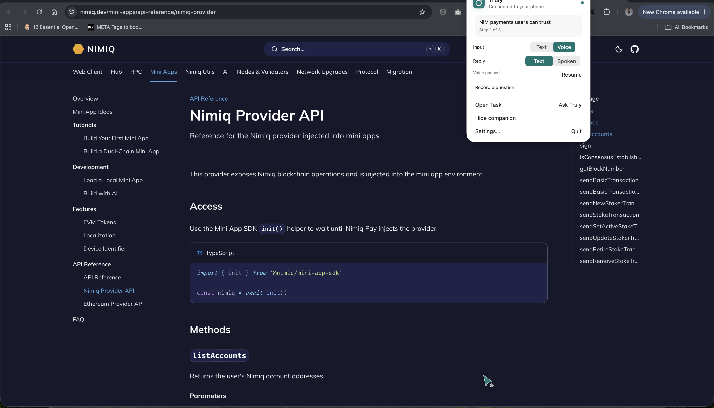
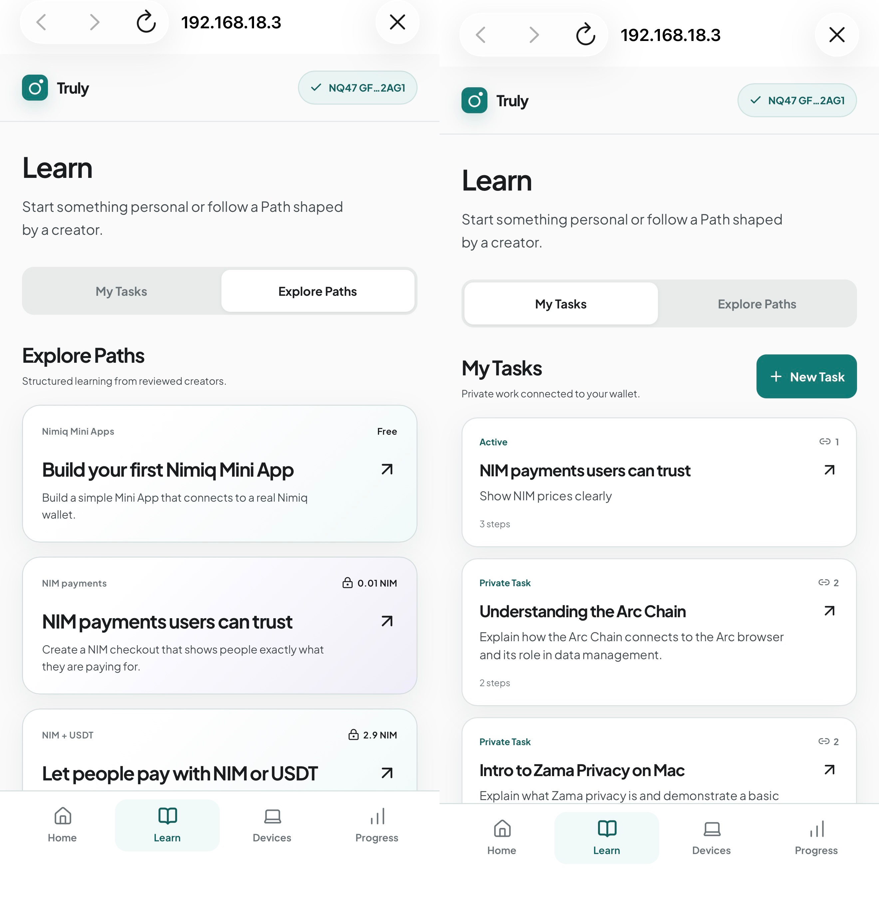
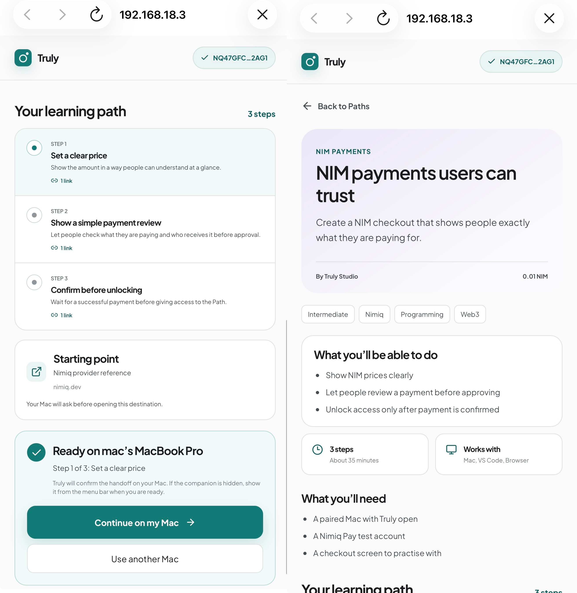
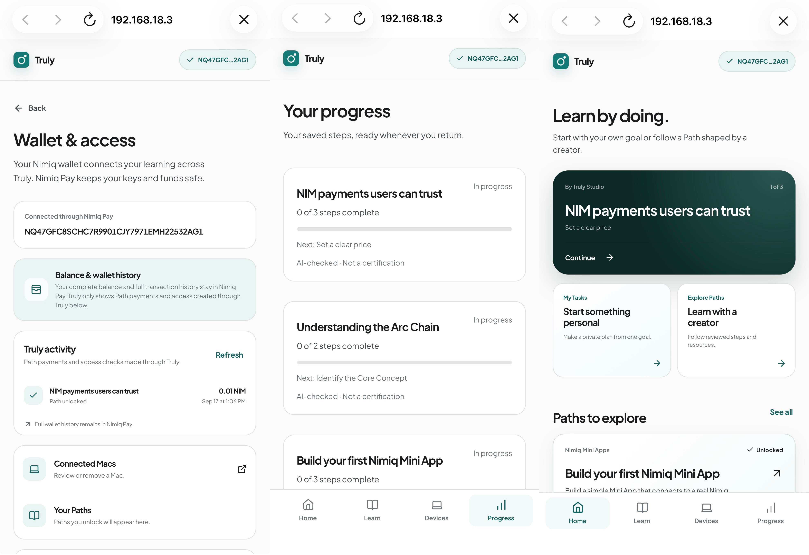
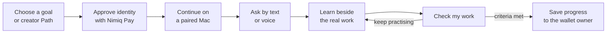
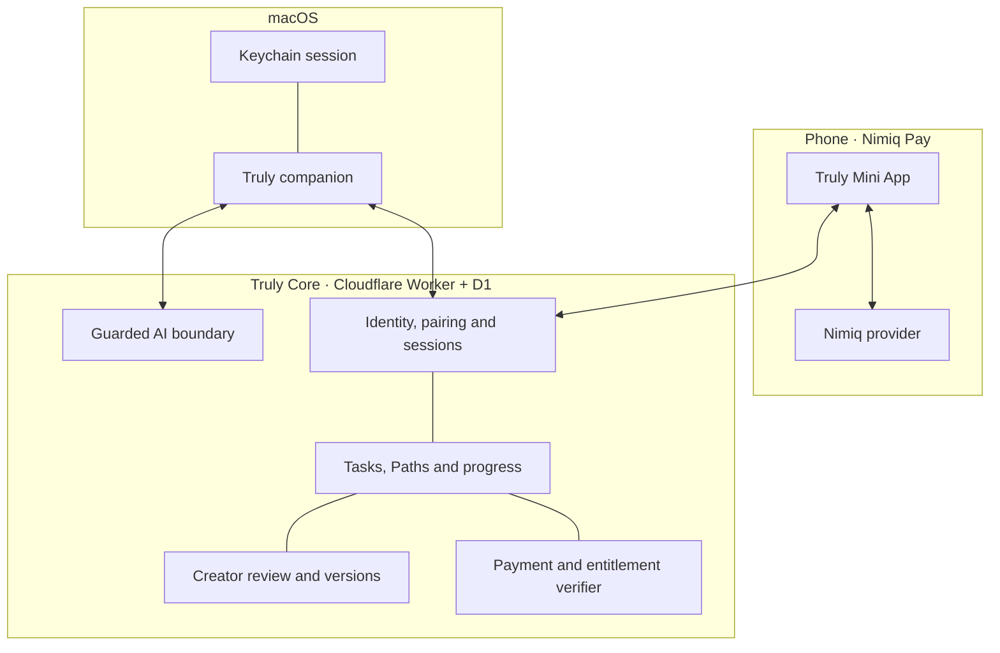

<div align="center">
  
  <h1>Truly</h1>
  <p><strong>Learn anything. By doing it.</strong></p>
  <p>A wallet-connected learning system that moves a goal from your phone to your Mac, teaches beside the real work, and records progress only after you show what you did.</p>
  <p>
    <a href="https://www.usetruly.site/">Website</a> ·
    <a href="https://www.usetruly.site/docs">Product guide</a> ·
    <a href="https://nimpay.app/miniapps/open/app.usetruly.site">Open in Nimiq Pay</a> ·
    <a href="#how-truly-works">How it works</a> ·
    <a href="#why-nimiq">Why Nimiq</a> ·
    <a href="#retention-and-revenue">Product model</a> ·
    <a href="#run-truly-locally">Run locally</a> ·
    <a href="docs/ARCHITECTURE.md">Architecture</a>
  </p>
</div>

> **Network note:** NIM Path purchases currently use Nimiq Testnet. Test NIM has no real-world value.

## Learning breaks when the work begins

Tutorials are usually separate from the tool where someone is trying to make progress. A learner leaves the editor, browser or design application, searches for an explanation, loses context and still has to work out whether the result is correct.

Truly keeps learning attached to the task. A learner chooses a personal goal or creator-made Path on their phone, continues it on a paired Mac, and asks for help beside the exact thing they are looking at. Truly can explain the visible idea, guide one next action, listen to a spoken question and speak its answer back.

When a step contains a practice goal, **Check my work** takes a fresh look at the visible result. Teaching never awards progress by itself; completion is a separate, deliberate action evaluated against the saved criteria.

## Product views

### The companion beside the work



The native companion stays close to the current application. The learner can type or speak, receive a written or spoken answer, open the active Task and check completed work without leaving the screen they are learning from.

### Phone, wallet and learning library

<table>
  <tr>
    <td width="50%"></td>
    <td width="50%"></td>
  </tr>
  <tr>
    <td colspan="2"></td>
  </tr>
</table>

## How Truly works



| Surface | Responsibility |
| --- | --- |
| **Truly for macOS** | Draggable screen-aware companion, text and voice questions, spoken replies, Task context, resources and deliberate practice checks. |
| **Truly Mini App** | Nimiq identity, account selection, signed Mac pairing, private Tasks, creator Paths, NIM purchases, devices, access and progress. |
| **Creator Studio** | Public creator profiles, private drafts, ordered steps and resources, free or NIM access, learner preview, review and versioned publishing. |
| **Truly Core** | Owner-scoped authority, sessions, immutable Path versions, payment verification, entitlements, AI boundaries, progress and review receipts. |
| **Product website** | Product story and a concise learner-and-creator guide. |

## Tasks and Paths

### Tasks belong to learners

A Task starts with an immediate goal. The learner reviews the proposed plan, can edit it before beginning and keeps it private to their wallet. The same Task and progress are available from the phone and the paired Mac.

### Paths package useful expertise

A Path is a creator-published learning product with ordered steps, explanations, resources, practice challenges and visible completion criteria. It can be free or priced in NIM. Starting a Path creates a learner-owned Task pinned to that approved version, so later creator updates never rewrite someone’s active plan.

Creators work privately until submission. Review applies to an exact saved version, publication is attributed to an authorized reviewer, and approved updates create new versions rather than mutating history.

## Retention and revenue

Truly is designed to retain learners through continuity and useful progress rather than feeds, streak pressure or passive content consumption.

- **Every goal becomes resumable work.** A Task remembers the current step and reopens at the first unfinished action.
- **The phone and Mac have distinct jobs.** The phone owns discovery, wallet access and progress; the Mac stays beside the work. Moving between them does not reset context.
- **Progress represents practice.** A learner returns to something they have actively started, with completed results and the next useful step visible.
- **The wallet becomes a durable library.** Private Tasks, free Paths, purchased Paths and their approved versions remain connected to the same owner.
- **Creators can improve without breaking trust.** New Path versions can become better products while existing learners retain the version they began.

Revenue is attached to useful learning products:

- Private Tasks and free Paths provide an open entry into Truly.
- Truly Studio can publish first-party premium Paths priced in NIM.
- Independent creators can choose free access or receive NIM for a paid Path through their verified wallet identity.
- Every paid unlock shows the version, price, network, creator and recipient before Nimiq Pay asks for approval.
- Access remains with the wallet owner after Core verifies settlement; the product does not depend on advertising or custody of learner funds.

The current implementation does not claim an automatic marketplace commission or subscription. See the [product model](docs/PRODUCT-MODEL.md) for the complete retention and commercial logic.

## Why Nimiq

Nimiq is the ownership and payment layer joining the entire product—not a checkout button added at the end.

1. **Wallet-owned identity** — purpose-bound signatures establish which learner, creator or reviewer is acting without creating another password system.
2. **Deliberate device trust** — the wallet approves the exact Mac being paired, and the phone can revoke that device later.
3. **Native creator payments** — a paid Path shows its version, NIM amount, network, creator and recipient before Nimiq Pay presents the transaction.
4. **Independent access decisions** — Truly Core verifies the executed and finalized transfer before writing one durable entitlement.
5. **Portable continuity** — purchases, Tasks, Path versions and progress remain attached to the wallet owner across phone and Mac.

Truly never receives wallet keys or recovery words. Nimiq Pay remains the source of truth for the complete portfolio and wallet history; Truly shows only the Path payments and access it has independently validated.

## End-to-end product integrity

The purchase and learning flow crosses the real product boundaries:

1. Nimiq Pay exposes the accounts the wallet has chosen to share.
2. A purpose-bound signature connects the learner and authorizes a selected Mac.
3. Truly Core creates an immutable order from the approved Path version and creator recipient.
4. Nimiq Pay shows the native transaction confirmation and sends the payment only after learner approval.
5. Core independently checks execution, finality, recipient, amount and order memo before granting access exactly once.
6. The unlocked Path becomes a wallet-owned Task that can be handed to the paired Mac.
7. A deliberate practice check advances the saved step only when every visible criterion is met.
8. Progress survives client restarts and resumes from the first unfinished step.

This flow has been exercised with a **0.01 test-NIM** Path purchase, native Nimiq Pay approval, independent settlement verification, Mac handoff and durable practice progress.

## Trust is part of the product

| Promise | Product enforcement |
| --- | --- |
| **No background screen history** | A bounded frame leaves the Mac only after Ask, an explicitly completed voice question or Check my work. Truly does not persist screenshots. |
| **Teaching cannot fake progress** | Teaching always reports that progress was not recorded. Assessment is a separate authenticated action. |
| **The learner stays in control** | Truly points and explains; it does not operate the keyboard, pointer, application or wallet. |
| **The wallet stays in charge** | Pairing, identity and payment use Nimiq Pay confirmations. Truly never asks for private keys or recovery words. |
| **Clients cannot grant themselves access** | Core resolves the live price and version, verifies settlement and writes the entitlement atomically. |
| **Published learning stays stable** | Learner Tasks pin an approved Path version. Creator updates append a new version. |
| **Review authority is server-owned** | Reviewer wallets come from a server allowlist and decide on a locked submitted revision. |

Read the [privacy model](docs/PRIVACY.md), [AI boundary](docs/AI.md), [architecture](docs/ARCHITECTURE.md) and [Creator Studio guide](docs/CREATOR-STUDIO.md).

## Architecture



Authority is intentionally split. The wallet approves identity, devices and payments. The Mac owns deliberate capture and the learning interaction. Core is the only component allowed to combine owner identity, device authority, immutable content, verified payment access and current progress.

See [docs/ARCHITECTURE.md](docs/ARCHITECTURE.md) for the full boundaries and data flows.

## Run Truly locally

### Requirements

- macOS with Xcode
- Node.js 22.13 or newer
- Nimiq Pay on a phone for native wallet, signature and payment flows
- A Groq API key with Zero Data Retention enabled for AI requests
- A Cloudflare account only for deployment; local D1 runs without one

Clone the repository:

```bash
git clone https://github.com/Femtech-web/Truly.git
cd Truly
```

### 1. Start Truly Core

```bash
cd worker
npm install --legacy-peer-deps
cp .dev.vars.example .dev.vars
npm run db:migrate:local
npm run dev
```

Set the Mini App origin in `ALLOWED_ORIGINS` and `PAIRING_ORIGIN`. For phone testing, use the Mac’s LAN address rather than `localhost`. Keep payment flags off unless you are following the controlled Nimiq Testnet setup in [worker/README.md](worker/README.md).

### 2. Start the Mini App

In another terminal:

```bash
cd apps/miniapp
npm install
cp .env.example .env
npm run dev -- --host 0.0.0.0
```

Set `VITE_TRULY_CORE_URL` to the Core URL reachable from the phone, then open Vite’s Network URL inside Nimiq Pay. A regular browser can preview public screens but cannot supply wallet identity.

### 3. Run Truly for macOS

Open `apps/desktop/Truly.xcodeproj`, select **Truly → My Mac**, and press **Command–R**. Grant Screen Recording when macOS requests it. Microphone and Speech Recognition are separate, optional permissions used only for voice.

Open the menu-bar app, go to **Settings → Connection**, and pair the Mac from the Mini App’s **Devices** screen.

### 4. Run the product site

```bash
cd apps/site
npm install
npm run dev
```

Visit `/docs` for the non-technical learner-and-creator guide. Stop each development server with **Control–C** when finished.

## Verification

These commands use local fixtures and require no wallet, funds or external AI request:

```bash
# Core protocol, persistence, payments and Creator Studio
cd worker && npm test && npm run build

# Mini App logic and production bundle
cd apps/miniapp && npm test && npm run build

# Public site bundle, including /docs
cd apps/site && npm run build
```

The native target is checked with Swift typechecking and focused policy tests. Wallet confirmations, Screen Recording, microphone, speech, WebView behavior and cross-device handoff are validated separately on physical devices.

## Repository map

```text
apps/
  desktop/       Native macOS companion (Swift, SwiftUI and AppKit)
  miniapp/       Nimiq Pay Mini App (React, TypeScript and Vite)
  site/          Product website and /docs guide
worker/          Truly Core (Cloudflare Worker and D1)
packages/
  contracts/     Shared API contracts
  design-tokens/ Cross-surface brand primitives
  skill-schema/  Shared legacy manifest compatibility
migrations/      Ordered D1 schema and seed migrations
docs/            Product, architecture, privacy and operating guides
```

Learner-facing language uses **Task** and **Path**. Some internal APIs retain `skill` identifiers for backward compatibility; see the [domain glossary](CONTEXT.md).

## Documentation

- [Product guide](docs/PRODUCT-GUIDE.md) — how learners and creators use Truly
- [Product model](docs/PRODUCT-MODEL.md) — retention, creator economics and product revenue
- [Architecture](docs/ARCHITECTURE.md) — components, authority and data flows
- [Privacy](docs/PRIVACY.md) — capture, voice, wallet and retention boundaries
- [AI boundary](docs/AI.md) — teaching, assessment and model safeguards
- [Creator Studio](docs/CREATOR-STUDIO.md) — authoring, review and versioning

## License

Truly is released under the [MIT License](LICENSE).
