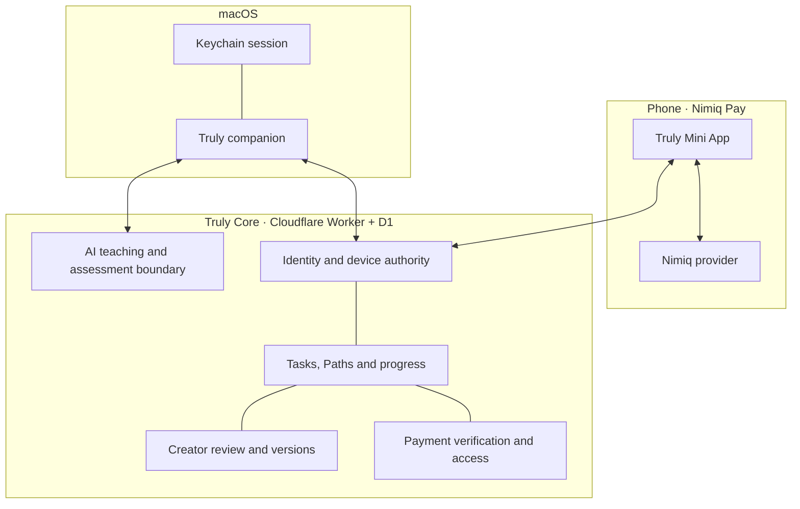
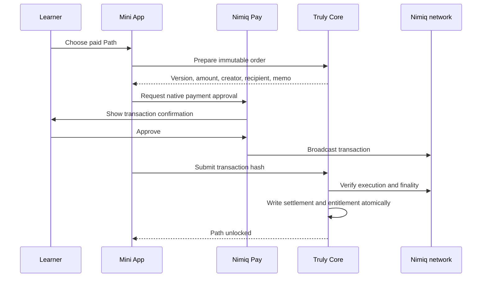

# Truly architecture

Truly separates authority across the wallet, phone, Mac and Core so no client can claim identity, payment, access or progress on its own.

## Product surfaces

### Nimiq Pay Mini App

The Mini App is the wallet-owned control surface. It requests accounts and signatures through providers injected by Nimiq Pay, then lets the user choose an exposed account explicitly. Truly cannot create or import a wallet, choose Nimiq Pay’s signing account, or access private keys.

The Mini App owns:

- wallet sign-in and account switching;
- signed Mac pairing and revocation;
- private Task creation and editing;
- creator Path discovery and purchase;
- Creator Studio and review access;
- progress, devices and Truly-specific payment activity.

### macOS companion

The native app is a menu-bar utility with a small draggable companion. AppKit owns the non-activating panels and cursor-adjacent answer card; SwiftUI owns the settings and Task surfaces.

The Mac owns deliberate screen and audio capture. Dragging, pointer movement and ordinary application clicks do not upload anything. The companion can be hidden without breaking handoff: a new phone activation produces a compact Task-ready notice while preserving the learner’s visibility preference.

Desktop credentials are stored in Keychain. A desktop session can read only the Task assigned to that authenticated Mac and cannot manage wallet devices or initiate payments.

### Truly Core

Truly Core is a Cloudflare Worker backed by D1. It owns the durable relationships between wallet identity, devices, Tasks, immutable Path versions, payments, entitlements, progress and creator review.

Core never accepts client claims such as “payment succeeded,” “this step is complete,” or “this wallet is an admin” without independently checking the authority and state required for that action.

### Product website

The public site explains the product and hosts the non-technical `/docs` guide. It contains no wallet authority and cannot create access or progress.

## Identity and device pairing

Wallet actions use short-lived, purpose-bound challenges. Core verifies the Nimiq signature and issues only the scopes required for the approved action. Browser sessions use an opaque server grant in a host-only HttpOnly, SameSite=Strict cookie; private requests also identify the expected wallet account.

Mac pairing uses a hashed short code and one-use exchange secret. The phone signs the exact device request, Core binds the approved wallet and installation, and the Mac stores its resulting credential in Keychain. Revocation invalidates the device and its desktop sessions atomically.

Changing wallet identity first revokes the current browser session, then remounts private screens and permission holders. Saved Tasks, purchases and paired devices remain attached to their original owner.

## Tasks, Paths and versions

A **Task** is wallet-owned work. A learner can create one directly from a goal, review and edit its plan before starting, then resume the same progress on phone and Mac.

A **Path** is creator-published content. Starting one creates or resumes a learner-owned Task pinned to the approved Path version. Creator updates append a new version; they do not rewrite the plan or access terms already attached to an existing learner.

Steps may include one primary workspace link and bounded supporting resources. Links are treated as untrusted content: secure web URLs are accepted, embedded credentials and unsupported schemes are rejected, and activating a Task never opens a destination automatically. The Mac shows the domain and waits for an explicit local Open action.

## Payment and entitlement flow

Core creates the order from the approved Path version, active NIM price and creator recipient. Access is granted only when the public transaction satisfies the expected network, sender authority, recipient, amount, order memo, execution and finality rules. Repeated checks return the same entitlement rather than granting access twice.

Nimiq Pay remains authoritative for the complete wallet portfolio and transaction history. Truly intentionally displays only its independently validated Path payments and access activity.

## Learning and progress

Phone handoff binds the wallet, paired Mac, learner Task, current step and any required entitlement. The desktop polls with its own credential and receives only its assigned active session.

Teaching and assessment are separate:

- `POST /v1/learning/turn` returns contextual teaching and never changes progress.
- `POST /v1/learning/attempts` evaluates a fresh, deliberate practice capture against the pinned criteria.

The assessor returns one observation for every saved criterion. Core validates the shape and coverage of that result, requires every criterion to be met at the configured confidence threshold, then atomically stores a minimal receipt and advances the Task. An idempotency key prevents duplicate requests from incrementing progress twice.

Screens, raw model observations, learner notes and transcripts are not stored as progress records. The product labels the result **AI-checked**, not certified.

## AI and voice boundary

Only a deliberate Ask, a completed opted-in voice question, or Check my work can send a bounded frame after the processor disclosure has been approved. Core authenticates the desktop, resolves the active Task and step, enforces size and usage limits, calls the configured model and validates structured output.

Hands-free recognition uses Apple Speech on-device. Ambient recognition is not streamed to Core. A completed confident question sends its text with one current frame; uncertain speech opens for review. Spoken replies use the built-in macOS synthesizer and suspend wake listening during playback.

The separate Record a question action captures bounded temporary audio for transcription. The Mac deletes the recording after reading it and Core does not persist the upload.

See [AI.md](AI.md) and [PRIVACY.md](PRIVACY.md) for the complete product boundaries.

## Creator publishing

Creator Studio requires its own wallet-signed approval. Drafts are private to their creator. Submission locks an exact revision. Reviewer wallets are configured server-side and use a separate signed review grant; being a creator never implies review authority.

Approval publishes the locked revision and records the reviewer identity atomically. Rejection returns notes without exposing the draft publicly. Existing learner Tasks continue using the version they started.

## Data and storage

| Data | Location | Protection |
| --- | --- | --- |
| Wallet keys and recovery words | Nimiq Pay | Never available to Truly |
| Browser grant | Truly Core + HttpOnly cookie | Hashed server state, fixed expiry |
| Desktop credential | Truly Core + macOS Keychain | Hashed server state, device-scoped |
| Tasks, Paths and progress | D1 | Wallet-owner and scope checks |
| Creator drafts and reviews | D1 | Creator/reviewer scope checks |
| Payment proofs | D1 + public chain references | Immutable order and settlement invariants |
| Current screen frame | Mac memory and bounded AI request | Deliberate capture, not persisted by Truly |
| Voice recording | Temporary Mac file and bounded transcription request | Deleted after reading, not persisted by Core |

## Technology

- **Desktop:** Swift, SwiftUI, AppKit and ScreenCaptureKit
- **Mini App:** React, TypeScript, Vite and `@nimiq/mini-app-sdk`
- **Website:** React, TypeScript and Vite
- **Core:** Cloudflare Workers and D1
- **AI:** guarded vision and transcription requests through Truly Core

Shared contracts and design tokens live in `packages/`. Wallet initialization and host-specific UI stay isolated inside the Mini App.
